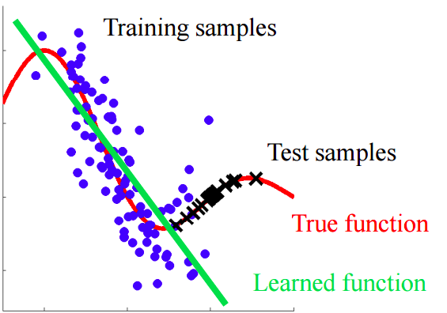

Learning Machines
===

This project is funded by the Turing Health programme, and the Turing Criminal Justice programme. Data and use cases from both domains will be specifically addressed during this project.

Machine learning techniques are effective for building predictive models because they are good at identifying patterns in large datasets. However, the development of a model for complex real life problems often stops at the point of publication or proof of concept. At the Turing we are interested in developing best practices for maintaining prediction models built using machine learning techniques. In particular, this Turing ASG project addresses the issue of keeping models updated, in order to reflect trends and changes in the current environment.

In the medical and criminal justice domain, data collecting and labelling under real world circumstances specifically for the application of machine learning is rare. The ability to store data to generate newly labelled data enables models to be updated when data changes to reflect trends over time. One core component of this project is to develop a generalised infrastructure for versioning new labelled data, so that they can be used to train and retrain models, developing the models as well as keeping them updated with changes over time.

Turing researchers engage with the Learning Machines project by addressing these questions:

Note: We are working on making 'uncertainty and explicability' into these goals
***
1. What are the common ways in which newly labelled data can change over time?
2. How do we automate detection of these changes, so that models can be retrained, and therefore kept updated?
3. How do we communicate the reasons for retraining the model to users tasked with maintenance?

Given that we want to use the machine learning model for sensitive tasks (i.e., healthcare and criminal justice), we are not only interested in the predictive power of the model, we also need to be able to evaluate its trustworthyness. In general there are three broad categoriez that we need to consider:

1. Uncertainty and confidence bounds for the model.
2. Explainability of predictions to human expert (medical or criminal justice staff).
3. Roboustness to error.
***

## Background

Maintenance of predictive models is crucial for effective long term use. A model developed using retrospective data in the medical domain risks becoming obsolete as medical treatments advance. In the case of cystic fibrosis, new treatments mean that patients can survive longer without the need for a lung transplant; this means that an algorithm that predicts when a patient requires a transplant will be gradually be making predictions about older patients with different comorbidities. Another example is when new treatments are introduced or new data types such as genomic profiles and imaging need to be incorporated into prediction models.

Retraining a single model can be computationally expensive. Retraining a model which comprises of an ensemble of dependent models is both expensive and complex. This is especially true if models provide absolute class decisions instead of probabilistic values, because absolute class decisions are based on carefully selected thresholds. Thresholds are selected to maximise metrics such as sensitivity or specificity, according to purposes of applications. Reselection of multiple thresholds to rebalance system performance is both complex and brittle.

For all these reasons, retraining models are difficult decisions. In addition resulting changes in model behaviour can be a source of uncertainty for users making high impact or high risk decisions. If reasons for making changes are not communicated clearly, this can result in user distrust and resistance.

(Put in something here about explainability black boxes unconvincing etc)

From Jack: How to create a machine that can seamlessly deal with changes in the availability of different data sources over time? How to determine when the model should be retrained?

From Jack: How to add a recency bias (i.e. should new data be weighted more heavily than older data)?

From Jack: * If considering different possible models: Why has a certain model been selected? - Accuracy vs interpretability trade off - False positives vs. false negatives etc. Ease of updating might be one factors to model selection

## Project Roadmap

The Learning Machines project will define a framework for researchers to engage with problem of keeping models current, when new data become available.

To achieve this goal, the project will first define the ways data can change. We are specifically looking to define changes which should trigger a model retrain if the model is to be kept current.

We will then find a number of open datasets from the health and criminal justice domains, and enumerate the types of changes found. This serves as examples in which real life data changes.

The next two steps should run in parallel:

A) We should then select a data set (preferably one, no more than three if trivial). Each dataset should be segmented by recency of collected data and we will train a model on older data, to answer a non trivial question. We will then compare two scenarios. Scenario A should test the model on recent data. Scenario B should retrain the model on a subsection of recent data, and test on remaining of recent data, keeping in mind distributions of data.

B) We should survey and run existing Turing research tools to detect changes in datasets

We will work with researchers to develop two different sets of tools. The first set are change-detection tools, the second are change-reporting tools. We will work with researchers to deploy these tools on health and criminal justice datasets.

## Types of data changes

There are many ways the source data used for a model can change during its
deployment, and sometimes a lot of overlap in the terms used to describe them.
We borrow some definitions used in probabilistic modelling and define the
following four main categories of data changes that may impact the performance
of a model (where we use drift or shift interchangeably as a generic way to
describe a data change):

- **Data drift:** Any change to the joint distribution of covariates and
the target variable.
- **Covariate drift:** Changes to the distribution of the covariates.
- **Prior probability shift:** Changes to the distribution of the target
variable.
- **Concept drift:** Changes to the relationship between the covariates and the
target variable.

These are also summarised in the diagram below, and described in more detail in
the following sections.


### 1. What is data drift - Jannetta to summarise
Microsoft defines "data drift" as the change in the model input data that leads to model performance degradation (https://docs.microsoft.com/en-us/azure/machine-learning/how-to-monitor-data-drift). A search, on Google and Google scholar, seems to suggest that there is not a clear distinction between data drift.

Links with references to the term "data drift":
* https://www.datanami.com/2016/02/03/keeping-on-top-of-data-drift/
* https://www.cmswire.com/digital-experience/data-drift-what-it-is-and-how-to-avoid-it/
* https://www.cmswire.com/big-data/big-datas-hidden-scourge-data-drift/

Taken from Mahed's notes: this is expected to happen in healthcare. One clear reason is that because of that better care that patients receive the distribution of their age is changing. However, this may or may not affect the model we are using. For example, if we are using a Bayesian model, this will supposedly affect the model, while it wont if we are using a decision tree. %This can have consequences like worse confidence bounds (higher uncertainty)


Dataset shift appears when training and test joint distributions are different:
```
P_train(y, x) != P_test(y, x)
```

#### 1.1 What data drift is not
#### 1.2 Relevant resources
#### 1.3 Examples cases (in English)

### 2. What is concept drift - Mahed to summarise
This is usually defined as the changes in the function that maps inputs to the outputs which the machine learning attempts to learn. It is possible in medical domain mostly because of changes that are possible in the practice of medicine. For instance, the reward we associate with a treatment may change because we may find out about a side effect, etc.


```
P_train(y|x) != P_test(y|x)
P_train(x) = P_test(x)
```

#### 2.1 What concept drift is not
It is not data drift (changes in the distribution of test data)!
#### 2.2 Relevant resources
https://arxiv.org/abs/1704.00362

https://link.springer.com/chapter/10.1007/978-3-642-16438-5_17

https://ieeexplore.ieee.org/document/6042653/metrics#metrics

https://arxiv.org/abs/1010.4784

https://www.win.tue.nl/~mpechen/publications/pubs/CD_applications15.pdf
#### 2.3 Examples cases (in English)

### 3. What is covariate drift - Jack to summarise

Covariates are the independent variables used as features in the model to
predict the value of the target variable. Covariate drift (or shift) refers to
cases where the distribution of these covariates is different in the training
data (the data used to train the model) and the test data (new data the model is
being used to make predictions for).

Specifically, it refers to cases where the distribution of the covariates has
changed, but the underlying relationship between the covariates and the target
variable has not changed. If a model was fit on a training dataset and is used to
make predictions on a test dataset, covariate drift is present if:
- `P_train(x) != P_test(x)`
- `P_train(y|x) = P_test(y|x)`

Although the true underlying relationship between the features and the target
variable (`P(y|x)`) is not changed, part of the relationship may be
misrepresented (or sparsely represented) in the training data and therefore
in the resulting fitted model. In simple terms, a model is unlikely (or less
likely) to perform well on examples that are different to those it has been
trained on. This is demonstrated in the figure below, where the learned function
(model) is a poor approximation of the true function for new test samples with a
different distribution.



*Source: http://iwann.ugr.es/2011/pdf/InvitedTalk-FHerrera-IWANN11.pdf*

Covariate shift can also cause bias in models trained with cross validation,
as different train/test folds of the dataset may have different
covariate distributions.

#### 3.1 What covariate drift is not

- If the underlying relationship between the covariates and the target
variable has changed (i.e. the function that maps the input features to the
output), that is concept drift not covariate drift.

- If the causal change is to the distribution of the target variables (e.g. the
  labels), not the distribution of the covariates, this is prior probability
  shift.


#### 3.2 Relevant resources

- Dataset Shift in Machine Learning, J. Quinonero-Candela et al.:
http://www.acad.bg/ebook/ml/The.MIT.Press.Dataset.Shift.in.Machine.Learning.Feb.2009.eBook-DDU.pdf

#### 3.3 Examples cases (in English)

- A model to predict the number of users of a bicycle sharing scheme trained on a
dataset including only the summer months is unlikely to make accurate predictions if
deployed and used during the winter months (due to different daylight hours and
extreme weather conditions, for example).

### 4. What is prior probability shift

Prior probability shift is similar to covariance drift but refers to differences
in the distribution of the target variable, as opposed to in the covariates,
and applies in the case of tasks modelled as "Y->X" problems.
[1] defines Y->X problems as:
>Where the class label causally determines the
values of the covariates. Medical diagnosis usually falls in this
category, where the disease, which is modeled as the class
label Y, determines the symptoms, represented in the machine
learning task as covariates X .

Prior probability shift is present if the distribution of labels (or target
variable values) in the training dataset is different to the distribution in the
test dataset
Changes in the distribution of the target variable y

Prior probability shift refers to cases where the distribution of the labels
(or target variable values) has changed, but the underlying relationship between
the target variable and the covariates has not changed.
If a model was fit on a training dataset and is used to
make predictions on a test dataset, prior probability shift is present if:
- `P_train(y) != P_test(y)`
- `P_train(x|y) = P_test(x|y)`

#### 4.1 What prior probability shift is not

- Changes in the distribution of the covariates, and X->Y problems, are
covariate shift, not prior probability shift.

- Changes in the underlying relationship between the target variable and the
covariates are concept shift, not prior probability shift.


#### 4.2 Relevant resources

- [1] **A unifying view on dataset shift in classification**,
_Jose G. Moreno-Torres, Troy Raeder, Rocio Alaiz-Rodriguez et al._,
Pattern Recognition 45, 2012,
https://rtg.cis.upenn.edu/cis700-2019/papers/dataset-shift/dataset-shift-terminology.pdf

#### 4.3 Example cases (in English)

- Two diseases which have identical symptoms but disease E is much more prevalent
in Europe and disease A in Asia. A model trained to classify diseases on European
data will perform poorly if applied to Asian patients, as it will incorrectly
work on the assumption that disease E is more likely.

- A spam email classifier where the training dataset has a much higher fraction
of spam emails than the test dataset.

### 5. Increase in erroneous data
From Mahed: human  error  is  possible  in  recording  and  entering  medical  data.   We  may want to account for this in the project.  This can be considered under the uncertainty topic.
#### 5.1 What erroneous data is not
#### 5.2 Relevant resources

### 6. Changes in the availability of data features

As described in the previous sections there are many subtle ways the covariates
or target variable used for a model can change during deployment.
However, if a model is deployed over an extended period of time it's also likely
to experience more abrupt changes. For example, a change in reporting policy at
a hospital could remove a field from patient records, which may have unforeseen
consequences for the performance of a model using that field as a covariate.
Alternatively, a new feature may become available, for example a new diagnostic
test, which is not used in the model but could potentially improve its
performance significantly.

## Methods for detecting drift

1) Prequential analysis - James Smith

2) Changepoint detection - Gerritt

3) Estimating predictive performance / cross-validation error / goodness-of-fit etc - Peter Foster

4) Uncertainty values in order to trust to a ML model prediction we need to know how certain the model is about the result. We are in particular interested to know how uncertainty changes with time as we get new samples. Also, preferably we need an individualized uncertainty report, i.e., the average accuracy of the method is not enough to justify prescriptions for individuals in sensitive applications like healthcare and criminal justice - Mahed

5) Uncertainty intervals change - What's the probability that a treatment plan is optimal/will be successful for a given patient? What's the uncertainty on that probability? - Jack R NOTES: Is Jack's point == Mahed's point?

6) Look out for gaps between distributions of training and newly labelled datasets.

## Methods for determining when a model should be retrained

Jack: Some drifts may not hurt model performance. Maybe step 1 is being able to
identify any kind of drift, and step 2 is determining when/which of those drifts
are likely to degrade the the model performance? Some of the methods we
currently have listed above may fall into this category rather than the generic
"detect a drift" category.

## Methods for explaining model performance change

May: One concept which is of interest in this project is intepretibility (Mahed and Mihaela's work). It would be of research interest to be able to explain what has changed. Can we build intepretibility in a predictive model or in a drift-detection model to explain why things have changed? This is important because 1) retraining is expensive, 2) seen as risky and 3) can generate new knowledge about the trends within the domain in which predictive model operates.

Taken from Mahed's notes: the  black  box  model  that  produce  predictions/recommendations  is  not  veryuseful for healthcare applications, since the medical staff should know why such a decision wasrecommended.  Explainability  also  can  be  used  in  potentially  observing  new  relations  amongvariables that leads to scientific discovery.  In learning machine project, it is also important to explain the possible changes in the model with time e.g.  why a recommendations has changedfor a patient when we updated the model with new data.

## Example datasets

Taken from Jack and Mahed's notes:

### Heart disease
***Description of dataset***
Resources
1. https://archive.ics.uci.edu/ml/datasets/Heart+Disease

### Breast cancer 1
***Description of dataset***
Resources
1. https://archive.ics.uci.edu/ml/datasets/Breast+Cancer+Wisconsin+%28Prognostic%29

### Breast cancer 2
***Description of dataset***

Resources
1. https://ieeexplore.ieee.org/abstract/document/7482682/

### Diabetes 1
***Simulator for diabetes data***

Resources
1. https://github.com/jxx123/simglucose

### Diabetes 2
***Description of dataset***

Resources
1. http://smarthealth.cs.ohio.edu/bglp/OhioT1DM-dataset-paper.pdf

### UK Cancer registry
(Symbolic metamodelling paper) Predict 5 year mortality risk of breast cancer patients using age, number of nodes, tumour size, tumour grade, Estrogen-receptor status.

### Meta-analysis Global Group in Chronic heart failure database (MAGGIC)
AutoPrognosis paper

### UK Biobank
AutoPrognosis paper

### United Network for Organ Sharing (UNOS) database
AutoPrognosis paper, UNOS-I: pre-transplant, UNOS-II post-transplant

### Surveillance, Epidemiology, and End Results (SEER) cancer registries
AutoPrognosis paper) Comorbidities - predict cardiac deaths in patients diagnosed with breast (SEER-I), colorectal (SEER-II), Leukemia (SEER-III), respiratory (SEER-IV), digestive (SEER-V), urinary (SEER-VI) cancers

Resources
1) Put URL here

### MIMIC critical care database
deidentified health data associated with ~60,000 intensive care unit admissions. It includes demographics, vital signs, laboratory tests, medications, and more

Resources
1) Put URL here

## Changes in datasets over time

Here we have have a summary of the types of changes we found in the datasets

| Dataset/Changes | Data drift | Concept drift | Covariate drift | Erroneous data |
|-----------------|------------|---------------|-----------------|----------------|
| Heart disease   | x          |               |                 |                |
| Breast cancer 1 |            | x             |                 |                |
| Breast cancer 2 |            |               | x               | x              |
| Diabetes 1      |            |               | x               | x              |
| Diabetes 2      |            |               | x               | x              |
