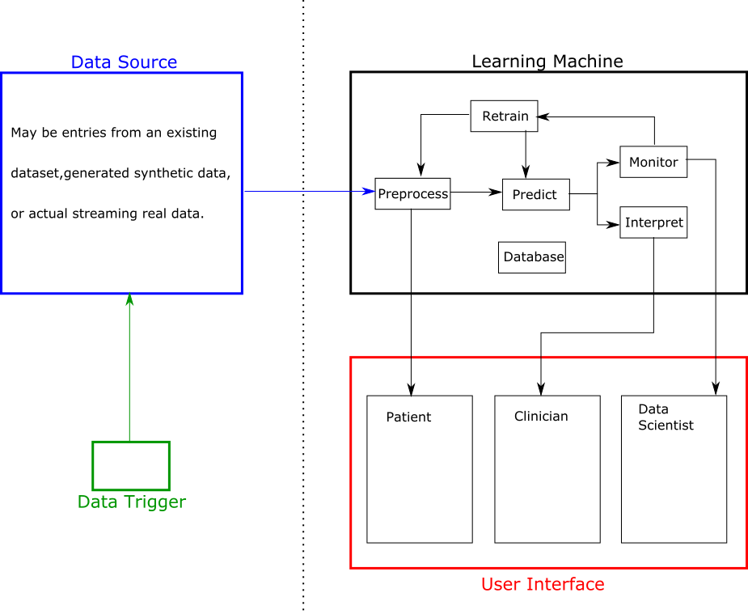

# Software Infrasturcture for Learning Machines

The proposed learning machine is a complex system with many components, and software engineering will therefore be a large part of the project. This document begins to sketch out the infrastructure involved in the Learning Machines project, our requirements, and some relevant pre-existing tools.

## System Components

The full software infrastructure for the Learning Machines project will consist of four separate components - the main Learning Machine system, a user interface, a data source or generation tool, and a trigger to run the whole system. These will interact roughly as seen in the diagram below, and are also described in slightly more detail below.

#### 1. Learning Machine

The core of the project will be a "Learning Machine" - a system incorporating a model that makes predictions on new data, provides insights into its decisions, monitors whether the model is performing as expected, and automatically retrains the model when appropriate.

Main blocks:
- Preprocess: Take input data from the data source and perform any necessary data cleaning and feature engineering steps.
- Predict: Use pre-trained model to make a prediction with the processed data.
- Interpret: Evaluate the model prediction and provide insights into which factors contributed to that decision.
- Monitor: Evaluate the performance of the model and identify drifts in the dataset, in order to trigger model retraining.
- Retrain: A pipeline to retrain the preprocessing and prediction steps.
- Database: Stores on input data, predictions and model evaluations, as well as different versions of the models themselves.

#### 2. User Interface

An interactive interface with visualisations showing the output of the system and how it works. Different sections showing:
- Patient data (model input)
- "Clinician" view: Model prediction and explanation for that prediction, i.e. what a clinician would be presented with to make a decision on how to diagnose/treat a patient.
- "Data Scientist" view: Model performance, drift monitoring and other metrics used to decide when to retrain the model.

#### 3. Data Source

A way to provide the input data to the Learning Machine. For demonstration purposes the data is likely to be either a pre-existing dataset and/or a mechanism to generate synthetic data. In a real world scenario, this block would represent live data (for example, a new patient test result) being uploaded  and sent to the model for processing.

In the demo scenario with a pre-existing dataset, for example, the data source will provide a way to sequentially send one row of data to the Learning Machine.

#### 4. Data Trigger

Simplest part of the system and could be considered as part of the Data Source or the User Interface, rather than a separate component. A way to trigger/schedule the data source to send new data to the Learning Machine. For example, trigger one new entry to be sent. Alternatively, send several new entries at once or perform a longer simulation, such as triggering one new data entry to be generated per second.

## Requirements

**Essential (will be part of toy model):**
- **Open Source:** Strong preference for everything to use open source tools.

- **Pipelines:** Self-contained blocks for different parts of the system with well-defined relationships between each block.

- **Tracking/logging:** Ways to track and visualise model performance, drifts and other metrics across different runs/time periods.

- **Automated:** Predictions, monitoring, retraining and other components should be triggered automatically and/or on a schedule.

- **APIs:** Each component of the system to interact via APIs.

**Preferred (will be part of future iterations):**

- **Machine learning project structure/management:** An (ideally) approach-agnostic way to structure and package a machine learning system. Maybe language-agnostic but we plan to focus on python.

- **Continuous deployment:** A way to update a block/component of the system, ideally keeping the system operational whilst the update is in progress.

- **Testing:** Tests to ensure that an update to one block/component does not break its interaction with other components. And also tests within each block/component to ensure they are working as expected.

- **Version control:** Code, models, data and all other parts of the system (or the system as a whole). A straightforward mechanism to change part of the (or the whole) system to a previous state.

- **Experiments:** Try new models without modifying the live production model. A development version of the system where it's ok to break something, and local development environments for each component of the system.

- **Privacy and Access control:** Who has permission to what and to do what?

- **Scaling:** A robust way to scale infrastructure to cope with demand. For example, model retraining is computationally intensive so additional hardware will be needed whilst retraining is in progress.

- **Ease of use:** Should be possible for an external user to implement their own version of the system.

# Pre-Existing Open Source Tools

## Tools Specifically Targeted at Machine Learning Workflows

### Most promising:
- **MLFow:** Good for comparing and visualising output of different training runs, quickly deploying models as an API. _Relevant for the Retrain and Predict blocks._
- **Kedro:** Good for project templating/structure, defining and visualising pipelines. _Relevant for system design and interface between blocks._
- **KubeFlow and Seldon Core:** Managing deployed machine learning systems on Kubernetes. _Relevant for overall system specification and management._

MLFlow and Kedro can also be used together to benefit from the metric tracking/visualisation parts of MLFlow, and the project management/pipeline strengths of Kedro. This is described in [this blog post](https://medium.com/@QuantumBlack/deploying-and-versioning-data-pipelines-at-scale-942b1d81b5f5).

KubeFlow and Seldon Core (for model serving) look very promising to me in terms of setting up complex infrastructure, being able to update the deployed model in a nice way (even distributing traffic between several different models), and monitoring the inputs or outputs of requests to the model end-points. However, I have almost zero experience with Kubernetes so I think it would be a steep learning curve.

### Also considered:
- **DVC (Data version control):** Git-like way to version control large files, such as data or trained models.
- **Pachyderm:** Versioned data and pipelines.

I mostly disregarded these for now as they mean using a tool-dependent file system, e.g. `.dvc` files for DVC and the `PFS` file system for Pachyderm. This implies that they may not be (easily) compatible with using standard SQL databases to store data. Pachyderm in particular does seem to have nice features, although some you have to pay for.

## General Tools for Software Infrastructure

There are many tools, not specific to Machine Learning purposes, that are relevant for the requirements of continuous deployment, creating complex workflows, managing infrastructure, and so on. These include but are not limited to:
- **Docker:** Containerised code. Most likely will be the basis for the toy model.
- **Airflow:** Creating and managing complex pipelines. Kedro plugin available.
- **Kubenetes:** Managing clusters of (docker) containers.
- **GoCD:** Continuous deployment.

The issues of reliable deployment, updating the system etc. will become more relevant for later iterations, rather than the toy model, in most cases. The specifics pros and cons of the many tools available should be investigated for this project.

# Pre-Existing Commercial Tools

All (at least many of) the big cloud platforms have services available that I think do most of what we're trying to achieve, i.e. providing ways to train, deploy, version control and monitor models. Databricks also seems to be a very popular tool in this area, and MLflow is an open sourced package from the same company. Azure, for example, has Databricks available on Azure ML.

# Outstanding Questions

- MLFlow in particular, but probably also Kedro, are focused at training a model and then using that model as is. Can they be used/adapted to also provide monitoring of the model being used to make predictions?
- Triggering workflows: Kedro (and probably also MLFLow) can be used to define pipelines but can they be automatically triggered/scheduled, or triggered only on some condition being met (e.g. on model performance dropping below some threshold)?
- How to update the deployed model? Ideally, a way to build and then serve the new model without any downtime, i.e. using the old model whilst the endpoint for the new model is being built.
- Schema/storage mechanism for data and artifacts (models etc.) How to keep track of what data was used to train a model, keep an archive of previous model versions, history of monitoring results etc. Parts of this can be solved with MLflow. For models or other artifacts the norm seems to be to have some cloud storage backend. 

# Notes on Tools

## MLflow

- _Open source package for packaging, deploying and tracking models_
- https://mlflow.org/

3 components:
1) MLflow Tracking: Record and query experiments (code, data, config, and results).
2) MLflow Projects: Packaging format for reproducible runs on any platform.
3) MLflow Models: General format for sending models to diverse deployment tools.

Command-line tools and python APIs for functionality

Some integration with Azure databricks

### MLflow tracking

Log parameters, code versions, metrics and output files when running code. Visualise/analyse and compare results.

Run has: code version (git commit), start/end time, source, parameters, metrics, artifacts (e.g. images, trained models, data etc.)

Runs recorded to local file, SQLAlchemy database or remote server.

Log metrics (performance tracking) with timestamp

Tracking UI for visualising metrics

Group runs - "experiments"

Query and compare runs

Runs configured for automated hyperparameter tuning

### MLflow Projects

Convention for organizing and describing your code.

Any Git repo can be treated as MLflow project

Run projects from a Git URI or local directory

MLflow can run projects based on a convention for placing files in the (Git) directory
 - a conda.yaml file is treated as a Conda environment
 - can describe your project in more detail by adding a MLproject  yaml file, can specify
   - name
   - entry points: commands (.py or .sh) and parameters
   - environment: local system, conda or docker
 - if directory doesn't have MLproject file, behaviour inferred from directory names etc.

Launch runs locally, databricks, kubernetes or any computing infrastucture
  - not sure what is "automatically" setup for databricks/kubernetes vs. something else

Multistep workflows combining project runs and tracking, e.g. output of some steps used as input to others. Launch runs in parallel.

### MLflow Models

Standard format for packaging machine learning models

Use that standard format e.g. to make REST API

Model is a directory containing (any) files and a MLmodel file.

MLmodel file defines "flavours" model is compatible with(?):
  - python function
  - R function
  - sklearn, Keras, PyTorch, TensorFlow
  - sagemaker (AWS)
  - pickled model
  - ...

Model can be used with any tool that supports any of the flavours in the MLmodel file

Also support for custom models/flavours

Built-in deployment tools - including deployment to Azure ML
  - local REST API
  - Docker container with REST API endpoint

## Kedro
- _Development workflow tool that helps structure reproducible, scaleable, deployable, robust and versioned data pipelines_
- https://kedro.readthedocs.io/en/stable/

## KubeFlow and Seldon Core
- _Making deployments of machine learning (ML) workflows on Kubernetes simple, portable and scalable_
- KubeFlow: https://www.kubeflow.org/
- Seldon-Core: https://docs.seldon.io/projects/seldon-core/en/latest/

Video describing Seldon Core features (model serving built on top of KubeFlow): https://www.youtube.com/watch?v=pDlapGtecbY

## DVC
- _Data Version Control for Machine Learning Projects_
- https://dvc.org/

Integrates with GitHub, meant to be nice way to version control large data files.

"dvc" files in repo with metadata about data, large files stored remotely elsewhere

Functionality to:
- store and retrieve version controlled data
- pipelines
- version control metrics (evaluate results of pipelines)
- experiments with different parameters

It all happens within the git repo so changes are commits etc., dvc used to bring
in/manage data files in a nice way?

## Pachyderm
- _Open source, containerised data science platform._
- https://www.pachyderm.com/

Two main components:
  - Pachyderm file system (PFS)
  - Pachyderm pipelines

Built on Docker and Kubernetes

Paid-for enterprise version provides:
  - admin/security features
  - dashboard/additional visualisations
  - additional job/data statistics

Instructions to deploy to Azure Kubernetes Service

### Versioned Data

"Git-like" operations

Each dataset is a repository - only have centralised repository not local copies
  - specifically each repo meant to be single data source, e.g. a single table?

Write data to an explicit commit (commit adds, updates or removes files)

Data can be continuously updated in "master" branch

Data repo stored in e.g. cloud repo
 - in pfs format, so can only view/interact with it via pachyderm?

Experiment with data at specific commits on separate branches

### Pipelines

Job spawner that waits for certain conditions to be met (e.g. wait for new data)

Specify an input (data) repo - created as /pfs/images in the pipeline container,
and outputs saved to /pfs/out is saved afterwards as an output repo with same name
as pipeline.

When pipeline created it's run on current master branch of input repo + on all future commits.

Pipelines triggered and run on new data only
  - example is new images being added
    - What if it's all in one file?
    - What if you want to use a database?
      - think you need to ingest the database into pachyderm, i.e. into a repo/pfs format first

Pipelines can have input from multiple repos, which can be combined and trigger the pipeline in different ways.

Can have many workers

## neptune.ai
_Experiment management workflow_\
https://neptune.ai/

## Azure Machine Learning and MLOps (commercial)
_Pipelines, automation, tracking etc._\
https://azure.microsoft.com/en-gb/services/machine-learning/

## Tensorboard*
_Measure and visualise model performance during training_\
_Living with Machines (Kasra) have used this_\
https://www.tensorflow.org/tensorboard\

## Databricks (commercial)

## Alteryx (commercial)

## rapidMiner (commercial)
